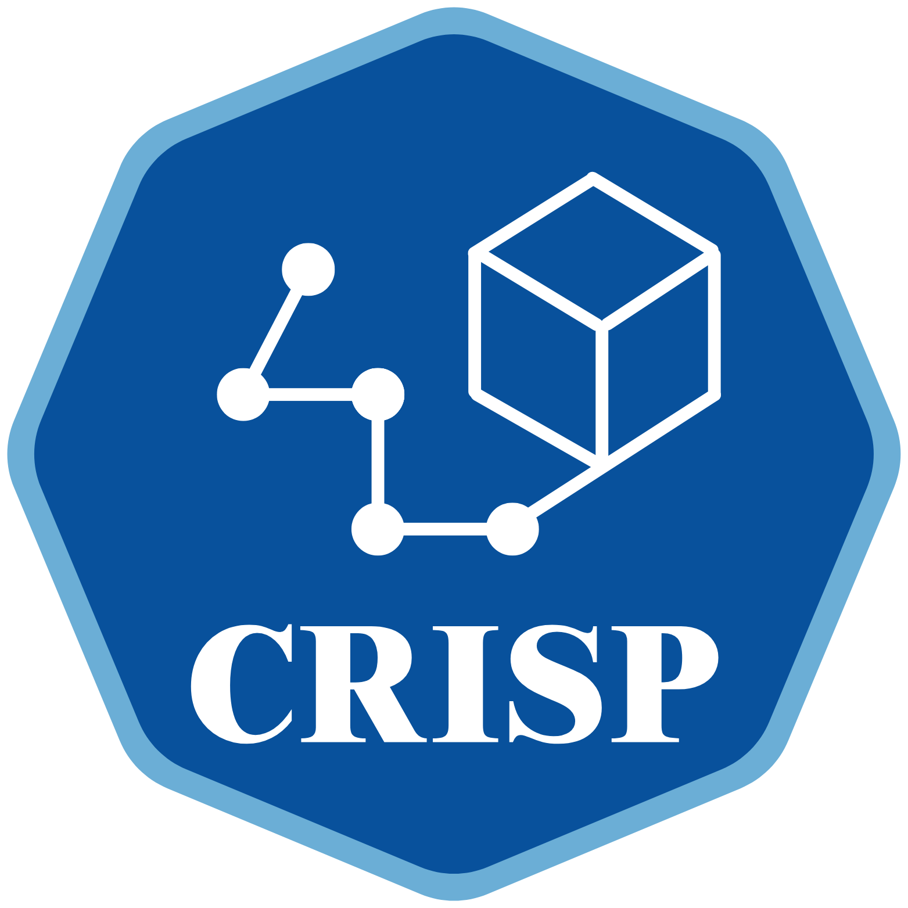

# CRISP: CRITICAL Records Integrated Standardization Pipeline

<div align="center">



<br>


[](https://ohdsi.github.io/CommonDataModel/cdm53.html)
[](LICENSE)


**Transforming Multi-Institutional Critical Care Data into ML-Ready Datasets**

*An open-source pipeline for harmonizing and standardizing large-scale OMOP CDM data from the [CRITICAL consortium](https://amia.org/webinar-library/critical-consortium-and-dataset)*

[Getting Started](#-getting-started) • [Documentation](#-documentation) • [Pipeline Modules](#-pipeline-architecture) • [Contributing](#-contributing)

</div>

---

## 🏥 About the CRITICAL Consortium

The **[CRITICAL](https://critical.fsm.northwestern.edu/data-access)** (Collaborative Resource for Intensive-care Translational science, Informatics, Comprehensive Analytics, and Learning) dataset is a multi-institutional, de-identified clinical dataset with ~400,000 patients and 571.7M records from 4 geographically diverse CTSA sites.

Learn more: [The CRITICAL Consortium and Dataset (AMIA Webinar)](https://amia.org/webinar-library/critical-consortium-and-dataset) | [Data Access](https://critical.fsm.northwestern.edu/data-access)

---

## 🌟 Overview

CRISP (CRITICAL Records Integrated Standardization Pipeline) unlocks the full potential of the CRITICAL dataset—**571.7M records** from **~400K patients** across **4 geographically diverse CTSA institutions**. Originally developed to handle this unprecedented scale and diversity, CRISP transforms raw OMOP CDM data into ML-ready datasets through:

| Feature | Description |
|---------|-------------|
| ✅ **Transparent Data Quality Management** | Comprehensive audit trails for all data transformations |
| ✅ **Cross-Vocabulary Mapping** | Sophisticated harmonization across heterogeneous medical terminologies |
| ✅ **Data Standardization** | Post-alignment normalization for multi-institutional consistency |
| ✅ **Modular Architecture** | Flexible pipeline supporting diverse research needs |

CRITICAL's unique strength lies in capturing **full-spectrum patient journeys**—pre-ICU, ICU, and post-ICU encounters across both inpatient and outpatient settings. CRISP democratizes access to this valuable multi-institutional resource, enabling researchers to focus on advancing clinical AI rather than spending months on data preprocessing.

## 🚀 Getting Started

### Prerequisites

- **Python 3.8+** (tested with Python 3.8.13)
- **Memory**: 16GB+ RAM recommended 
- **Storage**: ~2x your data size in available disk space
- **Data Format**: OMOP CDM v5.3 compatible

### Quick Installation

```bash
# Clone the repository
git clone https://github.com/AaronLuo00/crisp-pipeline.git
cd crisp-pipeline
```

**Option 1: Using Conda/Mamba (Recommended)**
```bash
# Create and activate environment
conda env create -f config/environment.yml
conda activate crisp-pipeline
```

**Option 2: Using pip**
```bash
# Create virtual environment (optional but recommended)
python -m venv venv
source venv/bin/activate  # On Windows: venv\Scripts\activate

# Install dependencies
pip install -r config/requirements.txt
```

### Your First Run

**Step 1: Prepare your data**

> **Important**: Even if you have your full dataset ready (~400,000 patients, ~300GB), we strongly recommend testing with a small sample (1000 patients) first to ensure pipeline configuration is correct.

**Option A: If starting fresh (Recommended)**
```bash
# Sample and extract from your OMOP data location
python data_preparation/sample_patients.py \
    --input-dir /path/to/your/OMOP_data/ \
    --output-dir data/ \
    --sample-size 1000 \
    --extract-all

# This automatically:
# 1. Samples 1000 patients from PERSON.csv
# 2. Extracts all related records from 14 OMOP tables
# 3. Saves everything to data/ directory
```

**Option B: If you already copied full dataset to data/**
```bash
# You can skip sampling, but we recommend testing with a sample first
# To sample from existing data in data/ directory:
python data_preparation/sample_patients.py \
    --input-dir data/ \
    --output-dir data_sample/ \
    --sample-size 1000 \
    --extract-all
```

**Step 2: Validate your data (Recommended)**
```bash
# Ensure your data meets OMOP CDM requirements
python data_preparation/validate_data.py --data-dir data/
```

**Step 3: Run the pipeline**
```bash
# Execute the complete pipeline
python pipeline_modules/run_all_module.py
```

Your processed data will be available in the `output/` directory.

### Output Structure

After running the pipeline, your results will be organized in two main locations:

**Pipeline Reports & Analytics** (`output/`)
- Module-specific reports, statistics, and intermediate processing results
- Each module creates its own subdirectory with detailed documentation
- Includes data processing reports, mapping statistics, and processing logs

**ML-Ready Patient Data** (`extracted_patient_data/`) 
- Final extracted patient-level data at the project root
- Structure: `extracted_patient_data/<patient_id>/<table_name>.csv`
- Each patient folder contains their complete OMOP CDM records
- Ready for direct use in machine learning pipelines

Example structure:
```
crisp-pipeline/
├── output/                          # Pipeline analytics & reports
│   ├── pipeline_runs/              # Timestamped complete pipeline runs
│   │   └── run_YYYYMMDD_HHMMSS/   # Individual run with all logs & results
│   ├── 1_eda/                      # EDA reports and visualizations
│   ├── 2_cleaning/                 # Cleaning statistics and logs
│   ├── 3_mapping/                  # Concept mapping reports
│   ├── 4_standardization/          # Standardization statistics
│   └── 5_extraction/               # Extraction reports and summaries
└── extracted_patient_data/         # Final ML-ready data
    ├── 400000000026076/           # Patient folder
    │   ├── PERSON.csv
    │   ├── MEASUREMENT.csv
    │   ├── OBSERVATION.csv
    │   ├── DRUG_EXPOSURE.csv
    │   └── ...
    └── 600000071123456/
        └── ...
```

## 🤖 Predictive Modeling (Optional)

CRISP includes a complete machine learning pipeline for ICU outcome prediction:

### What It Does
Predicts 4 critical ICU outcomes using extracted patient data:
- **Mortality**: 7-day and 30-day ICU mortality
- **Readmission**: 7-day, 30-day, and 90-day readmission
- **Length of Stay**: Extended stays (>3 days, >7 days)
- **Sepsis**: Post-ICU sepsis detection (24h, 48h, during ICU)

### Quick Start (Command Line)
```bash
# Run complete ML pipeline (after data extraction)
python predictive_modeling/run_all_modules.py

# Custom time window analysis (2H, 4H, or 8H)
python predictive_modeling/run_all_modules.py --time-window 8

# Include deep learning models
python predictive_modeling/run_all_modules.py --include-dl
```
See [predictive_modeling/README.md](predictive_modeling/README.md) for detailed documentation.

### Quick Start (Jupyter)

See [notebooks/02_ml_modeling_example.ipynb](notebooks/02_ml_modeling_example.ipynb) for detailed documentation.

### Key Features
- **Flexible Time Windows**: 2H, 4H, 8H configurable feature aggregation
- **Multiple Model Types**: Traditional ML (XGBoost, Random Forest) and Deep Learning (MLP, LSTM, TCN)
- **Automated Pipeline**: Feature engineering → Model training → Comprehensive evaluation
- **Class Imbalance Handling**: SMOTE for balanced training
- **Rich Evaluation**: AUROC, AUPRC, calibration plots, comparative analysis

## 📊 Pipeline Architecture

CRISP implements a **5-stage data cleaning pipeline**, each module building upon the previous:

```
Raw Data → [EDA] → [Cleaning] → [Mapping] → [Standardization] → [Extraction] → ML-Ready
                                                                                ↓
                                                                    [Predictive Modeling]
                                                                    (Optional ML Pipeline)
```

### Stage 1: Exploratory Data Analysis (EDA)
- **Purpose**: Understand dataset characteristics
- **Key Features**: 
  - Comprehensive statistical analysis and data profiling
  - Automated data quality metrics
  - Cohort identification (e.g., ICU patients via concept IDs: 581379, 32037)

### Stage 2: Data Cleaning
- **Purpose**: Ensure data integrity and consistency
- **Key Features**:
  - Duplicate removal using table-specific composite keys
  - Invalid concept ID filtering (null, 0, or non-existent)
  - Handle missing concept values
  - Temporal validation (ensuring start_date ≤ end_date)
  - Column pruning (removes features with >95% missing values)

### Stage 3: Concept Mapping
- **Purpose**: Standardize medical terminologies
- **Key Features**:
  - Maps LOINC, RxNorm, ICD codes to SNOMED CT vocabulary
  - Leverages OMOP vocabulary relationships
  - Handles 20+ vocabulary sources
  - Concept frequency analysis

### Stage 4: Data Standardization
- **Purpose**: Normalize values and formats
- **Key Features**:
  - Format standardization: DateTime to ISO 8601, missing values as NaN, ID columns as integers, measurements as floats
  - Unit harmonization: standardizes measurement units across institutions (e.g., temperatures to Celsius, weights to kg)
  - Statistical outlier detection and removal
  - Visit episode merging (configurable window)
  - Comprehensive statistics calculation

### Stage 5: Feature Extraction
- **Purpose**: Create ML-ready datasets
- **Key Features**:
  - Cohort-specific extraction
  - Feature aggregation
  - Patient-level data organization

## ⚡ Performance Optimizations

The pipeline has been optimized with parallel processing capabilities:
- **Parallel Processing**: All modules support concurrent execution for improved performance
- **Memory Optimization**: Chunk-based processing reduces memory footprint from O(n) to O(chunk_size)
- **T-Digest Algorithm**: Memory-efficient percentile calculation for statistical analysis

## 📚 Documentation

- [Getting Started Guide](asset/docs/getting_started.md) - Detailed setup and first steps
- [Pipeline Guide](asset/docs/pipeline_guide.md) - In-depth module documentation

## 🏗️ Project Structure

```
crisp-pipeline/
├── asset/                  # All project resources (Images and Docs)
├── config/                 # Configuration files
├── data/                   # Working datasets (sampled or full)
├── notebooks/              # Jupyter notebooks for exploration
├── pipeline_modules/       # Core processing modules
│   ├── 1_eda/             # Exploratory data analysis
│   ├── 2_cleaning/        # Data cleaning
│   ├── 3_mapping/         # Concept mapping
│   ├── 4_standardization/ # Data standardization
│   ├── 5_extraction/      # Feature extraction
│   └── run_all_module.py  # Main pipeline runner
├── predictive_modeling/   # ML pipeline (optional)
│   ├── 1_feature_engineering/  # Time-series feature extraction
│   ├── 2_model_training/       # Traditional & deep learning models
│   ├── 3_evaluation/           # Model evaluation & comparison
│   ├── modeling_results/       # Generated outputs
│   └── run_all_modules.py      # ML pipeline orchestrator
├── mapping_resources/     # Concept mapping resources
│   ├── *_concept_mapping.csv      # Unified mapping files
│   ├── original_mappings/         # Original frequency analysis
│   └── processed_mappings/        # SNOMED mapping references
├── output/                # Pipeline outputs (reports & statistics)
├── extracted_patient_data/ # Final patient-level data (created after extraction)
└── data_preparation/      # Data preparation and validation tools
```

## 🤝 Contributing

We welcome contributions! CRISP is designed to be extended and customized for different research needs.

### How to Contribute

1. Fork the repository
2. Create a feature branch (`git checkout -b feature/AmazingFeature`)
3. Commit your changes (`git commit -m 'Add some AmazingFeature'`)
4. Push to the branch (`git push origin feature/AmazingFeature`)
5. Open a Pull Request


## 📄 License

This project is licensed under the MIT License - see the [LICENSE](LICENSE) file for details.

## 📖 Citation

If you use CRISP in your research, please cite:

TBA

## 🙏 Acknowledgments

- [OHDSI Community](https://www.ohdsi.org/) and [OMOP CDM](https://ohdsi.github.io/CommonDataModel/index.html) for the standardized data model
- [CRITICAL Consortium](https://critical.fsm.northwestern.edu/data-access) for dataset access
- All contributors who have helped improve CRISP

## 📬 Contact & Support

- **Issues**: [GitHub Issues](https://github.com/AaronLuo00/crisp-pipeline/issues)
- **Discussions**: [GitHub Discussions](https://github.com/AaronLuo00/crisp-pipeline/discussions)
- **Email**: xiaolongluo@fas.harvard.edu

---

<div align="center">
<br>

### Empowering clinical AI research through open data standards

<p>
<strong>CRISP</strong> bridges the gap between raw clinical data and machine learning applications,<br>
making multi-institutional critical care research more accessible to the global research community.
</p>
<sub>If you find CRISP helpful in your research, please consider giving us a ⭐ on GitHub!</sub>

</div>
